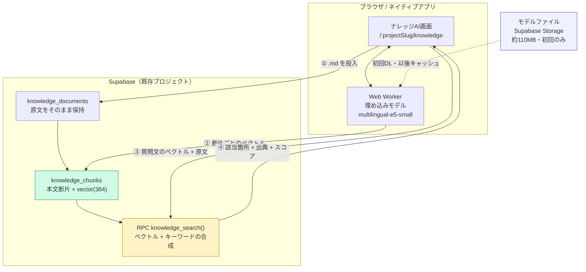
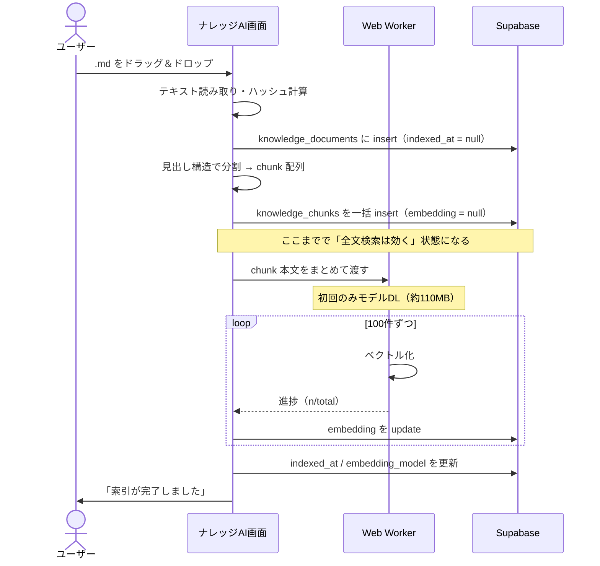

# ナレッジAI 設計書

> 対象: Markdown/テキスト資料を取り込み、**言葉が一致しなくても該当箇所を引ける**検索を提供する新機能
> 位置づけ: 既存の wiki / チケット / ファイルボックスとは**独立した箱**。既存テーブルには一切触れない
> ステータス: 設計確定待ち（実装未着手）
> 作成日: 2026-08-02

---

## 0. 決定事項（ヒアリング結果）

| # | 論点 | 決定 |
|---|------|------|
| ① | 保管場所 | **完全に独立した新テーブル**。wiki / チケットへの索引は張らない |
| ② | 箱の単位 | **プロジェクトに紐づく**。既存のプロジェクト権限をそのまま流用する |
| ③ | 対応形式 | **Markdown / テキストのみ**（`.md` `.markdown` `.txt`）。PDF・Word は対象外 |
| ④ | 検索方式 | **最初から意味検索まで**。ブラウザ内の埋め込みモデル＋pgvector |
| ⑤ | 回答生成 | **やらない**。LLM API 不使用の方針を維持する（[AI API不使用の制約](#)） |

### ①について（独立させる判断の根拠）

当初は「既存資産（wiki/議事録/チケット）を横断索引する」案を推していましたが、独立方式には実利があります。

- **リリースの影響範囲が閉じる**。既存テーブルにカラムもトリガも足さないので、既存機能を壊しようがない
- **プロジェクト資産にしたくない資料を置ける**。他社の仕様書、技術書、法令、競合調査など、wiki に混ぜたくないもの
- **将来、営業アプリからも同じ箱を使える**（同一 Supabase を共有するため）

代償は「wiki に書いた内容は引けない」ことです。ここは割り切り、必要なら wiki 側を後から索引対象に足せる構造にしておきます（§4-3 で `source_kind` を持たせる理由）。

### 機能名について（重要な運用上の注意）

表示名は **「ナレッジAI」**。既存の「スキル＆担当者レコメンドAI」と命名が揃い、実際に埋め込みモデル（ニューラルネット）を使うため、名称として不正確ではありません。

ただし **「AI」を冠すると「質問したら答えが返ってくる」と期待されます**。本機能は §2 のとおり意図的に生成をしないため、放置すると「AIなのに答えてくれない」という問い合わせを生みます。**期待値のズレは名前ではなく UI で防ぎます。**

| ルール | 理由 |
|--------|------|
| **チャットUI（吹き出し）にしない** | 対話を期待させる最大の要因。検索バー＋結果リストの形を守る |
| 検索バーのプレースホルダは「探したいことを文章で入力」 | 「質問」ではなく「検索」だと最初に示す |
| 結果は「回答」ではなく **「該当箇所」** として見せる | 見つけたものを提示する機能だと伝わる |
| 0件時は「該当する記述は見つかりませんでした（対象 N 件）」 | 「AIが答えを渋っている」という誤解を防ぐ |

**内部の識別子は `knowledge_` に統一**します（`AI` は表示名にのみ使う）。ルートは `/:projectSlug/knowledge`、テーブルは `knowledge_documents` / `knowledge_chunks` です。

---

## 1. ゴール

**「プロジェクトに関係する資料を放り込んでおけば、うろ覚えの言葉で聞いても該当箇所が出てくる」**状態を作ります。

具体例:

| 聞きたいこと | 現状（`ilike` 検索） | この機能 |
|-------------|-------------------|---------|
| 「セッションを両アプリで共有する話」 | 「セッション」を含む全ヒット。設計書に「Cookie SSO」としか書いていなければ**出ない** | 設計書 §3-3 が上位に出る |
| 「やじりが小さくなるバグ」 | 「やじり」がヒット | 同じ箇所＋関連する Elbow 修正の記述も出る |
| 「見積の工数をどう渡すか」 | 「見積」「工数」の AND/OR に苦戦 | `sales_quote_items.estimated_hours` の説明箇所が出る |

---

## 1-2. 方式の変遷（対話 → ブラウズ）

**結論: 対話で答える方式は採用しない。見出しを辿るブラウズ操作を主にする。**

### 試して駄目だった経緯

当初「NotebookLM のように対話で探したい」という要望から、
LLM を使わずに答えを返す **抽出型QA**（資料の中から答えにあたる文を選ぶ）を実装した。
実データ（営業アプリ設計書・86チャンク）で検証した結果、**破綻した**。

| 症状 | 原因 |
|------|------|
| 表のヘッダ行だけが返る（`｜ID｜ルート｜画面名｜`） | 情報が表のセルに散っており、1文を切り出しても答えにならない |
| 見出し行だけが返る（`### 6-7. sales_documents`） | 同上。見出しはラベルであって内容ではない |
| コード断片が返る（`content text not null default '',`） | チャンク境界がコードブロックを分断すると ``` の開閉が判定できない |
| スコアが 78〜81 に密集し、しきい値が機能しない | e5 の余弦類似度は値域が狭く、無関係でも 0.70 前後が出る |

節ごと返す・コード断片を除外する等の対策を3回重ねたが、
**設計書のように表とSQLが主体の資料では抽出型の天井**という結論に至った。
「この資料はなんの資料？」のような要約質問は、そもそも1文として存在しないため原理的に答えられない。

### 採用した方式: ブラウズ ＋ 補助的な検索

| | 内容 | 確実性 |
|---|------|--------|
| **主** | 資料の**見出しを機械的に拾って目次にし、押した節を表示する** | しきい値に依存しない。押せば必ずその節が出る |
| 従 | 意味検索（該当箇所を一覧表示。回答は作らない） | 補助。外れても目次で辿れる |

目次は Markdown の `#` を直接パースして作る（`outline.ts`）。
コードブロック内の `#` は除外し、階層は見出しレベルから組み立てる。
**検索の機械学習に一切依存しない**ため、常に正確に動く。

### 名称

「ナレッジ**AI**」→ **「ナレッジノート」**。
回答を生成しない以上「AI」を冠すると期待とズレる。実態に名前を合わせた。
内部識別子は `knowledge_` のまま（テーブル名・ルートは変更していない）。

## 1-3. フォルダ

資料を種類（設計書 / 議事録 / 参考資料 …）で仕分ける。**階層は1段**。

- 多段にすると「どこに入れたか分からない」が起きやすいため、意図的に1段に留める
- フォルダのチェックで**配下の資料をまとめて検索対象**にできる
- 資料はドラッグ＆ドロップでフォルダ間を移動できる
- フォルダを削除しても**資料は消えない**（未分類へ移動＝`on delete set null`）

DDL は `supabase/add_knowledge_folders.sql`。

## 2. スコープ外（明示的にやらないこと）

設計をぶらさないため、先に「やらない」を確定させます。

| やらないこと | 理由 |
|-------------|------|
| **LLM による回答生成** | dev-ticket の「AI API を機能に組み込まない」方針。対話はするが、返すのは**資料の原文**であって生成した文章ではない（§1-2） |
| **複数箇所の統合・要約・言い換え** | 抽出型QAの原理的な限界。「つまり？」「3行でまとめて」には答えられない |
| **ブラウザ内 LLM での生成** | 初回 2〜5GB のDLが必要で iPad では動かない。埋め込みモデル（約110MB）とは規模が2桁違う |
| **PDF / Word / Excel の取り込み** | 本文抽出の難易度が跳ね上がる（レイアウト崩れ・スキャンPDF）。まず Markdown で体験を固める |
| **wiki / チケットの索引** | ①の決定どおり。構造だけ残す |
| **OCR・画像内テキスト** | 費用対効果が合わない |

---

## 3. 全体構成



**サーバー側の新規実装はほぼ RPC 1本だけ**です。埋め込みの計算は全部ブラウザで行うため、Vercel の関数も外部 API も増えません。

---

## 4. データモデル

### 4-1. 方針

- テーブルは `knowledge_` prefix
- **原文は Storage ではなく Postgres の `text` 列に直接持つ**。Markdown は数百KB程度で、署名付きURLの往復が不要になり、原文ハイライト表示も楽になる
- 断片（chunk）は親ドキュメントに `on delete cascade`

### 4-2. `knowledge_documents` — 取り込んだ資料

```sql
create extension if not exists vector;

create table if not exists knowledge_documents (
  id             uuid primary key default gen_random_uuid(),
  project_id     text not null references projects(id) on delete cascade,
  title          text not null,                    -- 既定はファイル名（拡張子なし）
  file_name      text not null default '',
  content        text not null,                    -- 原文をそのまま保持
  content_hash   text not null default '',         -- 同一内容の再取り込みを検出する
  byte_size      int  not null default 0,
  tags           text[] not null default '{}',
  chunk_count    int  not null default 0,
  indexed_at     timestamptz,                      -- 埋め込み完了時刻。null = 未索引
  embedding_model text not null default '',        -- モデル差し替え時の再索引判定に使う
  uploaded_by    text not null default '',
  created_at     timestamptz not null default now(),
  updated_at     timestamptz not null default now()
);

create index if not exists idx_kn_docs_project on knowledge_documents(project_id, created_at desc);
```

### 4-3. `knowledge_chunks` — 検索の実体

```sql
create table if not exists knowledge_chunks (
  id            uuid primary key default gen_random_uuid(),
  document_id   uuid not null references knowledge_documents(id) on delete cascade,
  project_id    text not null,                     -- 非正規化。RLSと絞り込みを速く単純にする
  source_kind   text not null default 'knowledge',  -- 将来 wiki/minutes を索引する余地を残す
  seq           int  not null,                     -- ドキュメント内の並び順
  heading_path  text not null default '',          -- 「3. インフラ > 3-3. セッション共有」
  content       text not null,                     -- 断片本文
  char_start    int  not null default 0,           -- 原文内の開始位置（ハイライト用）
  char_end      int  not null default 0,
  embedding     vector(384),                       -- multilingual-e5-small の次元数
  created_at    timestamptz not null default now()
);

create index if not exists idx_kn_chunks_doc     on knowledge_chunks(document_id, seq);
create index if not exists idx_kn_chunks_project on knowledge_chunks(project_id);

-- 意味検索用（コサイン距離）。件数が数万に育っても効くよう HNSW を張る
create index if not exists idx_kn_chunks_vec on knowledge_chunks
  using hnsw (embedding vector_cosine_ops);

-- キーワード検索用。日本語は形態素解析が要るため trigram で代替する
create extension if not exists pg_trgm;
create index if not exists idx_kn_chunks_trgm on knowledge_chunks
  using gin (content gin_trgm_ops);
```

> **`source_kind` を最初から持たせる理由**
> 今回 wiki は索引しませんが、後から「wiki も対象に含めたい」となったとき、
> テーブル設計を変えずに行を足すだけで済みます。逆にこれが無いと作り直しになります。

### 4-4. RLS

既存の `get_my_org_id()` は組織単位なので、ここは**プロジェクトのメンバーシップ**で絞ります。
`projects.members` は `text[]`（メンバー名の配列）である点に注意します。

```sql
create or replace function can_access_project(p_project_id text)
returns boolean language sql stable security definer as $$
  select exists (
    select 1 from public.projects p
    join public.profiles me on me.id = auth.uid()
    where p.id = p_project_id
      and (
        me.role = 'owner'
        or (p.organization_id = me.organization_id and me.name = any(p.members))
        or (p.organization_id = me.organization_id and me.role in ('admin','project-manager'))
      )
  )
$$;

alter table knowledge_documents enable row level security;
alter table knowledge_chunks    enable row level security;

create policy "kn_docs_all" on knowledge_documents for all
  using (can_access_project(project_id)) with check (can_access_project(project_id));
create policy "kn_chunks_all" on knowledge_chunks for all
  using (can_access_project(project_id)) with check (can_access_project(project_id));
```

> ⚠️ **要確認**: `projects.members` の中身がメンバー名（`profiles.name`）か ID かを実装前に実データで確認すること。
> [types.ts](../src/app/types.ts) では `members: string[]` としか分からず、
> 既存の権限判定は [PermissionsPage](../src/app/pages/PermissionsPage.tsx) 系のロジックに散っています。

---

## 5. 取り込みパイプライン



**設計上の要点は「先に本文だけ保存して、ベクトルは後追いで埋める」ことです。**
埋め込みが終わる前でもキーワード検索は動き、途中でブラウザを閉じても本文は失われません。
`indexed_at is null` の資料は一覧に「索引中」バッジを出し、再開ボタンから続きを流せます。

### 5-1. チャンク分割の仕様

Markdown の構造を活かして切ります。単純な文字数分割は文脈が切れて精度が落ちます。

| ルール | 内容 |
|--------|------|
| 一次分割 | `##` `###` の見出し単位 |
| 二次分割 | 一次が長すぎる場合、**段落境界**で 400〜800 文字を目安に分ける |
| オーバーラップ | 隣接チャンクの末尾 80 文字を次のチャンク先頭に重ねる（境界での取りこぼし防止） |
| コードブロック | **分割しない**。長くても1チャンクに収める（途中で切ると無意味になる） |
| 表 | 行の途中で切らない。長い表はヘッダ行を各チャンクに複製する |
| 見出しパス | 各チャンクに `heading_path`（例: `3. インフラ > 3-3. セッション共有`）を付与 |
| 空チャンク | 空白のみ・20文字未満は捨てる |

見出しパスを本文の先頭に連結した文字列をベクトル化します。「どの文脈の話か」が埋め込みに乗り、精度が上がります。

---

## 6. 埋め込みモデル

### 6-1. 選定

| 項目 | 内容 |
|------|------|
| モデル | `multilingual-e5-small`（ONNX 量子化版） |
| 次元数 | 384 |
| サイズ | 約 110MB（初回のみDL、以後ブラウザにキャッシュ） |
| 実行 | transformers.js。WebGPU が使えれば GPU、無ければ WASM にフォールバック |
| 日本語 | 多言語モデルのため対応。日本語専用モデルより軽く、実用十分 |

**LLM（2〜5GB）とは規模が2桁違う**点が重要です。110MB なら初回数十秒で済み、iPad のメモリにも収まります。

### 6-2. 実装上の必須事項

**e5 系モデルは入力に接頭辞が必要**です。これを忘れると精度が明確に落ちます。

```ts
// 資料側（保存するベクトル）
const passage = `passage: ${headingPath}\n${chunkText}`;

// 質問側（検索時のベクトル）
const query = `query: ${userInput}`;
```

保存時と検索時で接頭辞を取り違えないよう、**変換関数を1箇所に集約**します（`src/app/lib/knowledge/embed.ts`）。

### 6-3. モデルファイルの配信

Hugging Face の CDN を直接叩くと、社内ファイアウォールや将来の CSP 強化で落ちる可能性があります。
**Supabase Storage の公開バケット（`models`）に置いて自前配信**します。

- バージョンをパスに含める（`models/e5-small-v1/...`）
- モデルを差し替えたら `embedding_model` 列で判定し、**全チャンクの再索引**が必要になる（§11 参照）

---

## 7. 検索

### 7-1. ハイブリッド検索

ベクトル検索だけでは、**固有名詞や識別子に弱い**という既知の弱点があります（「BRU10-043」「convert_deal_to_project」など）。
キーワード検索と合成します。

```sql
create or replace function knowledge_search(
  p_project_id text,
  p_query_vec  vector(384),
  p_query_text text,
  p_limit      int default 20
)
returns table (
  chunk_id     uuid,
  document_id  uuid,
  title        text,
  heading_path text,
  content      text,
  char_start   int,
  char_end     int,
  score        float
)
language sql stable security definer as $$
  with vec as (
    select c.id, 1 - (c.embedding <=> p_query_vec) as s
    from knowledge_chunks c
    where c.project_id = p_project_id and c.embedding is not null
    order by c.embedding <=> p_query_vec
    limit 50
  ),
  kw as (
    select c.id, similarity(c.content, p_query_text) as s
    from knowledge_chunks c
    where c.project_id = p_project_id and c.content ilike '%' || p_query_text || '%'
    limit 50
  ),
  merged as (
    select id, sum(w) as score from (
      select id, s * 0.7 as w from vec
      union all
      select id, s * 0.3 as w from kw
    ) t group by id
  )
  select c.id, c.document_id, d.title, c.heading_path, c.content,
         c.char_start, c.char_end, m.score
  from merged m
  join knowledge_chunks c on c.id = m.id
  join knowledge_documents d on d.id = c.document_id
  where can_access_project(c.project_id)
  order by m.score desc
  limit p_limit;
$$;
```

重み `0.7 / 0.3` は初期値です。使ってみて調整できるよう、**設定値として外に出しておく**か、少なくとも1箇所にまとめます。

### 7-2. 結果の見せ方

生成をしない代わりに、**「どこに書いてあるか」を的確に示す**ことに全力を注ぎます。

- 資料名 ＋ 見出しパス（`営業アプリ設計書 > 3. インフラ > 3-3. セッション共有`）
- 該当箇所の抜粋（前後 2〜3 行）＋ 一致部分のハイライト
- スコアバー（どれくらい近いか）
- クリックで原文パネルを開き、`char_start` の位置へスクロール＋ハイライト

---

## 8. 画面設計

| ID | ルート | 画面 | 主な内容 |
|----|--------|------|---------|
| KN-01 | `/:projectSlug/knowledge` | ナレッジAIトップ | 資料一覧（カード）／ドラッグ＆ドロップ投入／検索バー／索引状況 |
| KN-02 | `/:projectSlug/knowledge?q=...` | 検索結果 | 同一画面。結果カード（資料名・見出しパス・抜粋・スコア） |
| KN-03 | `/:projectSlug/knowledge/:docId` | 原文ビュー | 原文を書式つきで表示。該当箇所へジャンプ＋ハイライト |
| KD-01 | （モーダル） | 取り込み進捗 | 「分割中 → ベクトル化 12/86」の進捗と中断ボタン |
| KD-02 | （モーダル） | 資料の削除確認 | チャンクごと削除される旨を明示 |

**入口**: [ProjectSubNav.tsx](../src/app/components/layout/ProjectSubNav.tsx) に「ナレッジAI」を追加します（wiki / 議事録 / ファイル / ホワイトボードの並び）。

**表示**: 原文は既存の [markdown](../src/app/lib/markdown/) で HTML 化し、[RichEditor](../src/app/components/shared/RichEditor.tsx) の閲覧モードで描画します。Mermaid もそのまま図になります。

---

## 9. 既存資産の流用

| 必要なもの | 流用元 | 備考 |
|-----------|--------|------|
| Markdown → HTML 変換 | [lib/markdown/](../src/app/lib/markdown/) | **BRU10-043 でファイル取り込みまで実装済み** |
| ファイルのドラッグ＆ドロップ | [RichEditor.tsx](../src/app/components/shared/RichEditor.tsx) の `handleDrop` | 同上 |
| 一覧・カードUI | [FileBoxPage.tsx](../src/app/pages/FileBoxPage.tsx) | 構造をほぼそのまま使える |
| 原文の描画 | RichEditor（`readOnly`） | Mermaid・表・コードも描画される |
| 進捗オーバーレイ | [ExportProgressOverlay.tsx](../src/app/components/shared/ExportProgressOverlay.tsx) | 記事エクスポートの進捗表示と同じ形 |
| プロジェクト配下ルート | [AppRoutes.tsx](../src/app/components/layout/AppRoutes.tsx) | `/:projectSlug/files` と同じ静的セグメント方式 |

**新規に書くのは「チャンク分割」「埋め込み Worker」「検索RPC」「ナレッジAI画面」の4つ**です。

---

## 10. プランによるゲート

既存の流儀（[PlanContext](../src/app/contexts/PlanContext.tsx)）に合わせます。

```sql
alter table plans add column if not exists feature_knowledge_ai boolean not null default false;
alter table plans add column if not exists max_knowledge_docs_per_project int;
```

未契約の組織にはサブナビに項目を出しません。

---

## 11. 実装順序

**④の決定どおり、Phase 1〜2 をまとめて1リリース**とします。Phase 1 単体でも動く形にしておくのは、途中で問題が出たときに切り離せるようにするためです。

| Phase | 内容 | 完成時の状態 |
|-------|------|-------------|
| **1. 箱を作る** | テーブル・RLS・ナレッジAI画面・取り込み（分割まで）・キーワード検索 | **資料を溜めて全文検索できる**。ベクトルなしで動く |
| **2. 意味検索** | 埋め込み Worker・モデル配信・`knowledge_search` RPC・結果表示 | **うろ覚えの言葉で引ける**（本命） |
| 3. 精度調整 | ハイブリッド重み調整・チャンクサイズ調整・再索引機能 | 実データを見ながら詰める |
| 4. 拡張 | `source_kind` を使って wiki / 議事録も索引対象に含める | 判断は Phase 3 の結果を見てから |

---

## 12. リスクと要検証

| # | リスク | 影響 | 対策 / 確認方法 |
|---|-------|------|---------------|
| ① | **iPad / WKWebView で transformers.js が動くか** | 動かなければネイティブ版で意味検索が使えない | **実装前に実機で最小検証する**（最大の未知数）。WASM フォールバックで動く見込みだが速度は要実測 |
| ② | Supabase で `vector` / `pg_trgm` 拡張が有効化できるか | 設計の土台が崩れる | ダッシュボードの Extensions で確認。pgvector は標準搭載の認識だが**未確認** |
| ③ | 初回 110MB のDL体験 | 「重いアプリ」という印象 | ナレッジAI画面を開いた時点で先読み開始。検索を押した瞬間から待たせない |
| ④ | モデル差し替え時の全再索引 | 資料が増えるほど再計算が重い | `embedding_model` 列で世代管理。再索引はバックグラウンドで逐次実行 |
| ⑤ | `projects.members` の実データ形式 | RLS が正しく効かない | §4-4 のとおり実装前に確認 |
| ⑥ | 日本語の trigram 検索精度 | キーワード側が弱い | pg_bigm 等が使えるか併せて確認。使えなければベクトル比重を上げる |
| ⑦ | 大量投入時の insert 負荷 | 取り込みが遅い | 100件ずつのバッチ insert。UI は進捗を出して待たせる |

---

## 13. 確認したい残論点

1. **1プロジェクト＝1つの箱でよいか。**ホワイトボードのように「複数の箱」を作れる形にするかどうか。現設計は1つ（タグで整理）にしています。
2. **資料の編集を許すか。**現設計は「取り込んだ原文は読み取り専用、直したければ再取り込み」です。編集可にすると再索引の管理が増えます。
3. **同名ファイルの再取り込み**をバージョンとして残すか、上書きするか。`content_hash` で同一内容の再投入は弾く想定です。
4. **検索対象の切り替え UI**（「この資料だけを対象に」）を Phase 2 に含めるか。NotebookLM 的な体験にはこれが効きます。
5. **プロジェクトを跨いだ検索**の需要があるか。現設計は `project_id` 固定です。
