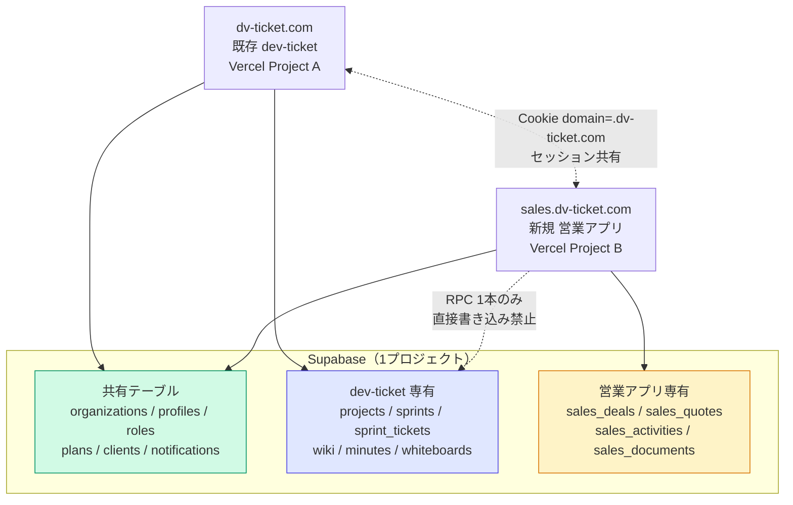
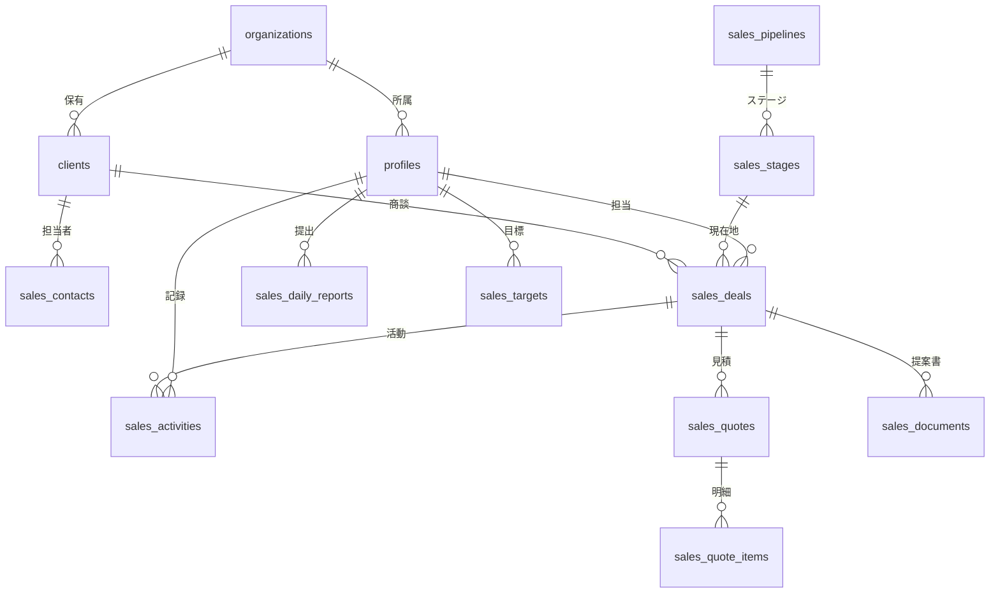
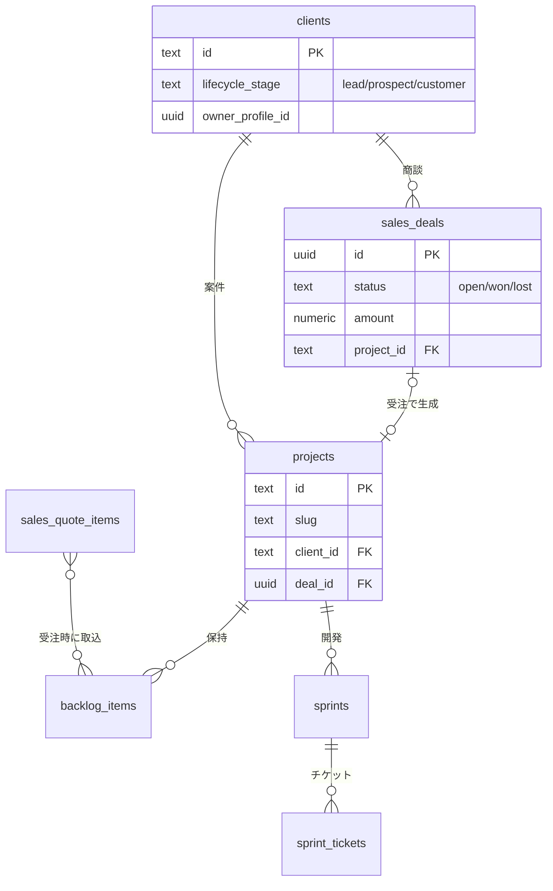
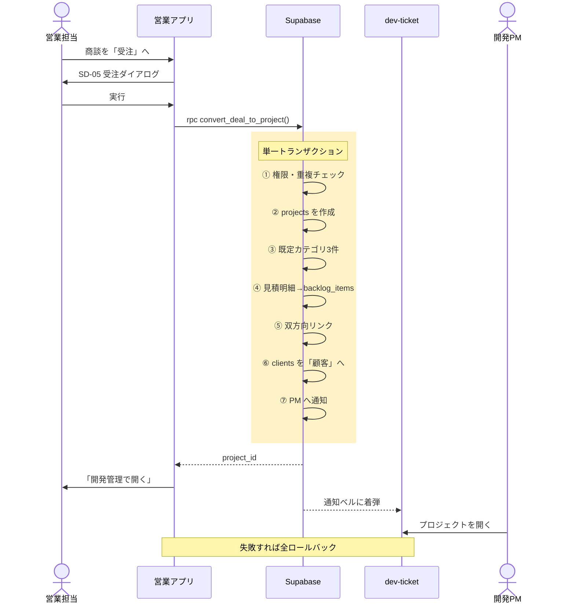
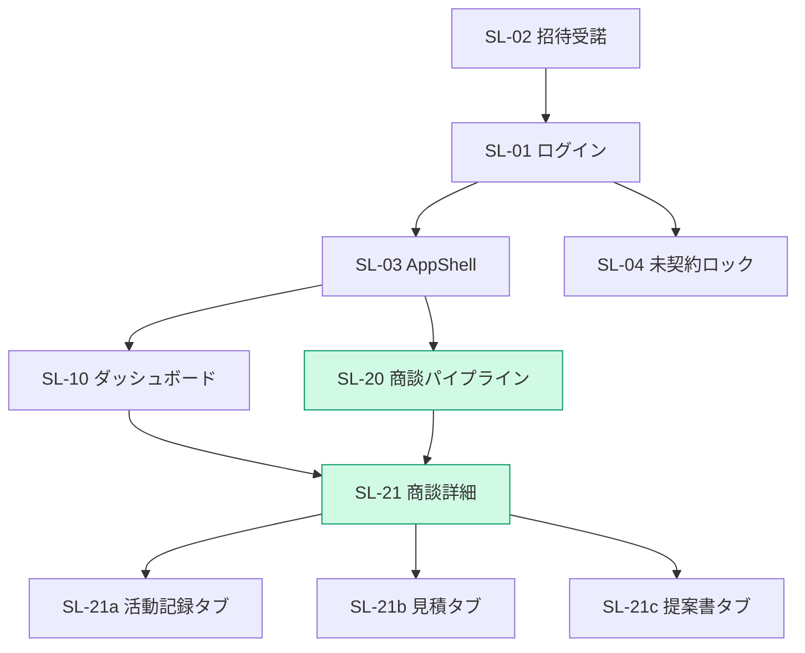
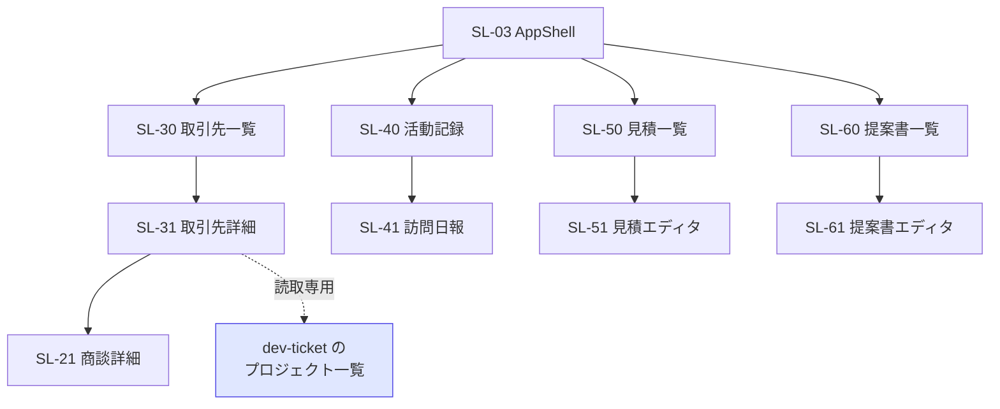
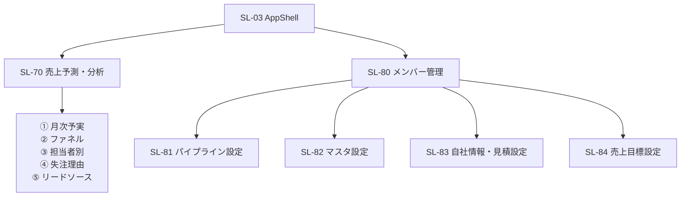
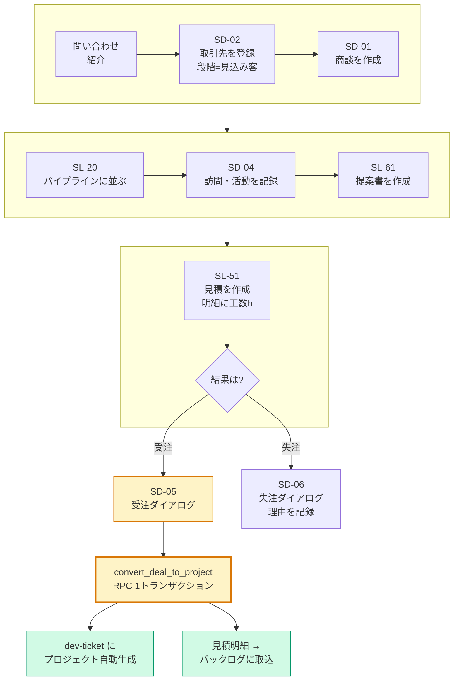
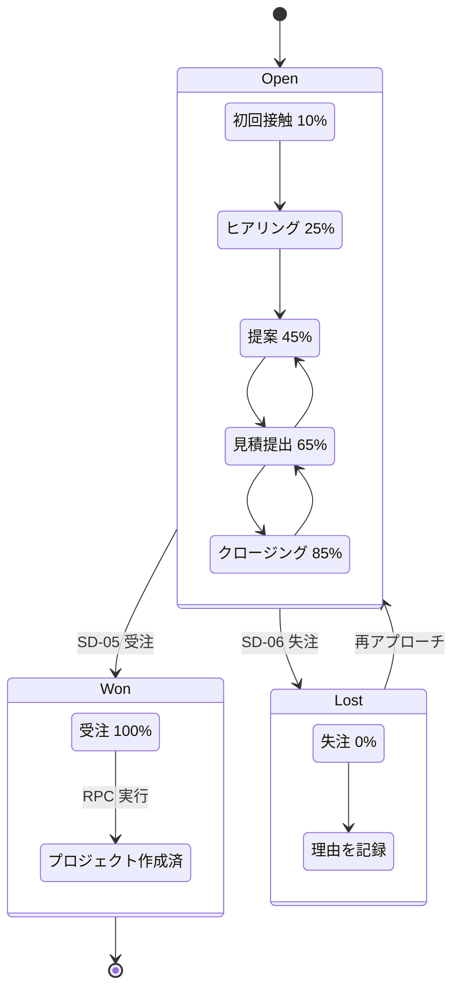
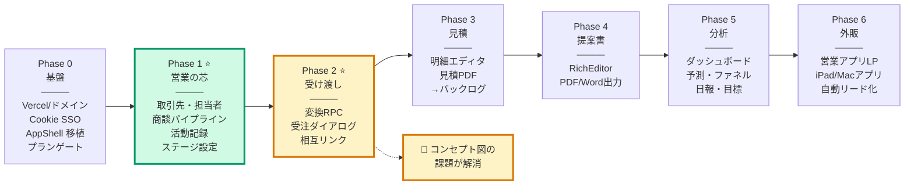

# 営業アプリ（仮称: Dev Ticket Sales）設計書

> 対象: プロジェクト立ち上げ**前**の営業フェーズを扱う姉妹アプリ
> 位置づけ: dev-ticket と同一 Supabase を共有し、「受注 → 開発プロジェクト起票」で地続きにつながる
> ステータス: 設計確定待ち（実装未着手）
> 作成日: 2026-08-01

---

## 0. 決定事項サマリ（ヒアリング結果）

| # | 論点 | 決定 |
|---|------|------|
| ① | データ基盤 | **dev-ticket と同一 Supabase プロジェクトを共有**。`organizations` / `profiles` / `roles` / `plans` / `clients` / `notifications` は共通テーブルとして流用し、営業固有は `sales_*` prefix で新設 |
| ② | 配信形態 | **別リポジトリ・別 Vercel プロジェクト**、`sales.dv-ticket.com`（サブドメイン） |
| ③ | 機能スコープ | リード・商談パイプライン／見積・提案書／活動記録・訪問日報／売上予測ダッシュボード（4領域すべて） |
| ④ | 提供先 | **dev-ticket 顧客へも販売する SaaS**。`organizations` 単位のマルチテナント、`plans` による機能ゲート、招待フローを最初から載せる |

### ②についての訂正
ご希望の `dv-ticket-sales.com` は「サブドメイン」ではなく**別ドメインの新規取得**にあたり、年額のドメイン費用が別途かかります。無料で追加できるのは `sales.dv-ticket.com` の形（既存ドメインのサブドメイン）です。

そして今回は**技術的にもサブドメインの方が明確に有利**です。理由は §3 のとおりで、`sales.dv-ticket.com` と `dv-ticket.com` は Cookie の `domain=.dv-ticket.com` を共有できるため、**両アプリでログインセッションを共有（SSO）できます**。別ドメインではこれが原理的に不可能で、アプリを行き来するたびに再ログインが必要になります。

→ **`sales.dv-ticket.com` を採用**します。

---

## 1. ゴール（コンセプト図の分解）

| # | 要件 | 実現方法（結論） |
|---|------|------------------|
| ① | 営業段階（セールス〜受注）を管理するツールがない | 商談パイプライン・活動記録・見積・提案書を持つ独立 SPA を新設 |
| ② | 「開発受け渡し」を仕組みにする | 受注確定時に Postgres RPC `convert_deal_to_project()` を1トランザクションで実行し、`projects` / `ticket_categories` / `backlog_items` を自動起票。同一 DB なので API 連携もバッチ同期も不要 |
| ③ | 姉妹アプリとして一体感を持たせる | 認証・組織・メンバー・権限・プランを共有。UI トークン（緑 #059669 系）とレイアウト部品を移植。相互にランチャーリンク |
| ④ | dev-ticket 顧客にも売れる形にする | 最初から `organization_id` 前提・RLS 厳格・`plans.feature_sales_app` によるゲート |

---

## 2. dev-ticket 側の前提（調査で確定した土台）

設計の根拠になる既存仕様。ここを外すと連携が壊れます。

### 2-1. マルチテナントは「アプリ側フィルタ ＋ RLS」の二段構え
- `profiles.organization_id`（TEXT / FK なし）が所属組織。`owner` ロールだけが全組織を横断できる（[OrgContext.tsx:35-49](../src/app/contexts/OrgContext.tsx#L35-L49)）。
- RLS のヘルパー `get_my_org_id()` が既にある（[fix_multitenant_rls.sql:11-20](../supabase/fix_multitenant_rls.sql#L11-L20)）。**新規テーブルはこれをそのまま使う**。
- 既存テーブルのポリシーは `organization_id = get_my_org_id() OR organization_id IS NULL`（NULL 許容＝移行前データの救済）。**新テーブルは NULL 許容しない**（最初から厳格でよい）。
- ⚠ `profiles.organization_id` は環境によって uuid / text のどちらもあり得るため、SQL 内では `::text` を明示するのが既存流儀（[add_skill_history.sql:133](../supabase/add_skill_history.sql#L133) のコメント）。

### 2-2. 権限は `roles.base_permissions`（JSONB）が唯一の根拠
- `profiles.permissions` は旧仕様で無視される（[AuthContext.tsx:80-84](../src/app/contexts/AuthContext.tsx#L80-L84)）。
- `roles` テーブルは `organization_id = NULL` が標準ロール、非 NULL が組織固有ロール（[RolesPage.tsx:58-60](../src/app/pages/RolesPage.tsx#L58-L60)）。
- `owner` はテーブルを見ずにコード側で全権限（[AuthContext.tsx:52-63](../src/app/contexts/AuthContext.tsx#L52-L63)）。
- → **営業権限フラグは同じ `base_permissions` JSON に追記するだけで、既存の RolesPage の UI がそのまま管理画面になる**。

### 2-3. プランによる機能ゲートの型が既にある
- `plans` テーブル ＋ `PlanContext`（[PlanContext.tsx](../src/app/contexts/PlanContext.tsx)）。`feature_*` boolean と `max_*` int という素直な形。
- → 営業アプリの契約有無も `plans.feature_sales_app` として同じ棚に置く。

### 2-4. `clients` は「取引先マスタ」としてほぼ空っぽ
- カラムは `id(text) / name / industry / email / phone / status / organization_id` のみ（[schema.sql:45-54](../supabase/schema.sql#L45-L54)）。
- id は `C-${Date.now()}` で採番（[ClientFormDialog.tsx:36](../src/app/components/clients/ClientFormDialog.tsx#L36)）。
- `projects.client` は **client 名の文字列コピー**であって FK ではない（[schema.sql:61](../supabase/schema.sql#L61)）。
- → 営業アプリはこの `clients` を**共有マスタとして育てる**（リード段階も同じテーブルで持つ）。

### 2-5. 流用できる既存資産（新規実装をかなり減らせる）
| 資産 | 場所 | 営業アプリでの用途 |
|------|------|--------------------|
| リッチエディタ | [RichEditor.tsx](../src/app/components/shared/RichEditor.tsx) | 提案書・活動記録の本文 |
| 記事エクスポート（PDF/Word/Excel） | [articleExport/](../src/app/lib/articleExport/) | 提案書出力・見積 PDF の土台（日本語フォント埋込み済み） |
| グラフ | recharts（[ReportsPage.tsx](../src/app/pages/ReportsPage.tsx)） | 売上予測・ファネル |
| カンバン DnD | react-dnd（[ProjectBoard.tsx](../src/app/components/projects/ProjectBoard.tsx)） | 商談パイプライン |
| レイアウト一式 | [layout/](../src/app/components/layout/) | Sidebar / Topbar / AppShell |
| 共通 UI 部品 | [shared/](../src/app/components/shared/) | Dialog / Field / DatePicker / Toast / Confirm |
| 招待フロー | [api/invite.ts](../api/invite.ts) ＋ [AcceptInvitePage.tsx](../src/app/pages/AcceptInvitePage.tsx) | 営業メンバー招待（同じ profiles に入るので**そのまま使える**） |
| CSV 出力 | [csvExport.ts](../src/app/lib/csvExport.ts) | 商談・活動の書き出し |

### 2-6. 既知の地雷（設計で回避する）
| 地雷 | 内容 | 対処 |
|------|------|------|
| `notifications.user_name` | 通知の宛先が **表示名（TEXT）** キー。同姓同名で誤配される（[Topbar.tsx:191-204](../src/app/components/layout/Topbar.tsx#L191-L204)） | 営業側の通知は `user_id uuid` を新設して併走させ、将来 dev-ticket も移行 |
| `projects.client` が文字列コピー | 取引先名を変えても projects に追従しない | 受注変換時に `projects.client_id` を新設して FK 相当を持たせる（`client` 文字列は互換のため残す） |
| anon key は両アプリ共通 | 営業アプリのバグが開発データを壊し得る | **営業アプリのコードから `projects` / `sprints` / `sprint_tickets` への直接 INSERT/UPDATE を禁止**。書き込みは RPC 1本のみ（§7） |
| `clients.id` が TEXT の時刻採番 | 一括インポート時に衝突し得る | 採番関数を共有化し、衝突時は連番サフィックス |

---

## 3. インフラ・ドメイン・SSO

### 3-1. 構成図



> 図 F-01　システム全体構成

### 3-2. サブドメインの設定（費用ゼロ）
1. Vercel で新規プロジェクト `dev-ticket-sales` を作成
2. Settings → Domains に `sales.dv-ticket.com` を追加
3. DNS に `CNAME sales → cname.vercel-dns.com` を1行追加
4. 証明書は Vercel が自動発行

既存の `dv-ticket.com` の設定・デプロイには一切触れません。

### 3-3. セッション共有（SSO）— サブドメインを選ぶ最大の理由

**現状の問題**: Supabase JS のデフォルトはセッションを `localStorage` に保存する（[supabase.ts](../src/lib/supabase.ts) は既定のまま）。localStorage は**オリジン単位**なので、サブドメインでも共有されません。このままだとアプリを行き来するたびに再ログインになります。

**対策**: 両アプリの `createClient` に **Cookie ストレージアダプタ** を差し込む。

```ts
// shared/cookieStorage.ts（両リポジトリに同じものを置く）
// Supabase のセッション JSON は 4KB を超えうるので、Cookie を分割保存する。
// （@supabase/ssr が採用している方式と同じ考え方。依存追加は不要）
const CHUNK = 3200;
const DOMAIN = location.hostname.endsWith("dv-ticket.com") ? ".dv-ticket.com" : undefined;

function write(name: string, value: string) {
  const attrs = `path=/;${DOMAIN ? `domain=${DOMAIN};` : ""}max-age=31536000;SameSite=Lax${location.protocol === "https:" ? ";Secure" : ""}`;
  document.cookie = `${name}=${encodeURIComponent(value)};${attrs}`;
}

export const cookieStorage = {
  getItem(key: string) {
    const all = Object.fromEntries(document.cookie.split("; ").map(c => {
      const i = c.indexOf("="); return [c.slice(0, i), decodeURIComponent(c.slice(i + 1))];
    }));
    if (all[key] !== undefined) return all[key];
    let out = "", i = 0;
    while (all[`${key}.${i}`] !== undefined) out += all[`${key}.${i++}`];
    return out || null;
  },
  setItem(key: string, value: string) {
    // 既存チャンクを消してから書き直す（縮んだときの残骸を防ぐ）
    for (let i = 0; i < 8; i++) write(`${key}.${i}`, ""), (document.cookie = `${key}.${i}=;path=/;${DOMAIN ? `domain=${DOMAIN};` : ""}max-age=0`);
    if (value.length <= CHUNK) return write(key, value);
    document.cookie = `${key}=;path=/;${DOMAIN ? `domain=${DOMAIN};` : ""}max-age=0`;
    for (let i = 0; i * CHUNK < value.length; i++) write(`${key}.${i}`, value.slice(i * CHUNK, (i + 1) * CHUNK));
  },
  removeItem(key: string) { this.setItem(key, ""); },
};
```

```ts
export const supabase = createClient(url, key, {
  auth: { storage: cookieStorage, storageKey: "dt-auth", persistSession: true, autoRefreshToken: true },
});
```

**移行**: dev-ticket 側は既存ユーザーが localStorage にセッションを持っているため、初回起動時に一度だけ `sb-<projectRef>-auth-token` を読んで Cookie へ引っ越し、localStorage 側を削除する（10行程度）。引っ越しに失敗しても再ログインで復帰するだけなので安全。

**ローカル開発**: `localhost:5173`（dev-ticket）と `localhost:5174`（営業）は**ホストが同じ**ため、domain 指定なしの Cookie がそのまま共有されます。本番と同じ挙動で検証できます。

**代替案（採用しない）**: 遷移時にワンタイムトークンを URL fragment で渡す方式。リフレッシュトークンが履歴やログに残るリスクがあり、別ドメインを選んだ場合の最後の手段。

### 3-4. 自動ログアウトも共有する
ENHA2-027 の毎晩3時ログアウト（[autoLogout.ts](../src/app/lib/autoLogout.ts)）はログイン時刻を localStorage に持っています。これも Cookie 化して両アプリで共有し、**片方でログアウトすればもう片方も落ちる**状態にします（片方だけ生き残るのはセキュリティ上まずい）。

---

## 4. 権限モデル

### 4-1. `UserPermissions` への追加フラグ

`roles.base_permissions`（JSONB）に以下を追記します。JSONB なのでスキーマ変更は不要、型定義を両アプリで揃えるだけです。

| フラグ | 意味 |
|--------|------|
| `canAccessSales` | 営業アプリ自体を開けるか（false なら sales.dv-ticket.com でロック画面） |
| `dealPermission: "none"｜"view"｜"edit"` | 商談の閲覧／編集 |
| `canViewAllDeals` | false なら**自分が担当の商談のみ**表示（一般営業）。true でチーム全体（マネージャー） |
| `canEditQuote` | 見積の作成・編集 |
| `canApproveQuote` | 見積を「送付可」に承認できる（値引き決裁の代わり） |
| `canConvertToProject` | 受注 → 開発プロジェクト起票を実行できる（**最重要。ここだけは絞る**） |
| `canAccessSalesReports` | 売上予測・分析ダッシュボード |
| `canAccessSalesSettings` | パイプライン定義・失注理由・見積テンプレの管理 |

dev-ticket 側の [RolesPage.tsx](../src/app/pages/RolesPage.tsx) は `visiblePermFlags` を回して UI を描いているので、**フラグ定義を足すだけで営業権限もそこで管理できます**（「営業アプリ」セクションとしてグルーピング。`plans.feature_sales_app` が false の組織には非表示）。

### 4-2. 標準ロールの追加
`roles` に `organization_id = NULL` で seed します。

| name | label | 権限の概略 |
|------|-------|-----------|
| `sales` | 営業担当 | `canAccessSales` / `dealPermission=edit` / `canEditQuote` / 自分の商談のみ |
| `sales-manager` | 営業マネージャー | 上記 ＋ `canViewAllDeals` / `canApproveQuote` / `canConvertToProject` / `canAccessSalesReports` / `canAccessSalesSettings` |

既存の `admin` / `project-manager` にも `canAccessSales: true` と `canConvertToProject: true` を足すのが自然です（開発 PM が受け取り側なので）。`owner` は §2-2 のとおりコード側で全権限なので、[AuthContext.tsx:52-63](../src/app/contexts/AuthContext.tsx#L52-L63) に営業フラグを追記します。

### 4-3. 「自分の商談のみ」の実現方法
RLS ではなく**アプリ側フィルタ**（`.eq("owner_profile_id", userId)`）で実装します。既存アプリの流儀に合わせるためと、RLS に担当者条件を入れるとマネージャー視点の集計クエリが軒並み複雑化するためです。RLS は組織境界の防壁に徹します。

---

## 5. プラン／課金ゲート

```sql
alter table plans add column if not exists feature_sales_app  boolean not null default false;
alter table plans add column if not exists max_deals          int;      -- null = 無制限
alter table plans add column if not exists max_sales_members  int;
alter table plans add column if not exists feature_quote_pdf  boolean not null default true;
alter table plans add column if not exists feature_sales_forecast boolean not null default true;
update plans set feature_sales_app = true where id = 'system-unlimited';
```

- 営業アプリ起動時に `plan.featureSalesApp === false` なら、ダッシュボードの代わりに「営業アプリはご契約に含まれていません」画面＋問い合わせ導線を出す。
- dev-ticket の Topbar に「営業アプリへ ↗」ランチャーを追加（契約組織のみ表示）。営業アプリ側にも「開発管理へ ↗」を置く。
- `PlanContext` は営業アプリへ**そのままコピー**（`mapPlan` に新フィールドを足すだけ）。

---

## 6. データモデル

命名規則: 営業固有テーブルはすべて `sales_` prefix。全テーブルに `organization_id TEXT NOT NULL`（子テーブルも非正規化して持つ＝ポリシーが単純で速い）。

### 6-0. 全体像（ER 図）



> 図 F-08　データモデル ① 営業ドメイン

dev-ticket 側とつながる面だけを抜き出すと、次のようになります。`clients` が両アプリの共有マスタ、`sales_deals` ↔ `projects` が受注で結ばれる 1:1 のリンク、`sales_quote_items` → `backlog_items` が見積工数の受け渡し経路です。



> 図 F-09　データモデル ② dev-ticket との連携面

### 6-1. `clients` の拡張（共有マスタを育てる）

リードを別テーブルにせず、`clients` に**ライフサイクル段階**を持たせて1本で通します。受注後に dev-ticket 側でそのまま取引先として見えるのが最大の利点です。

```sql
alter table clients add column if not exists lifecycle_stage text not null default 'customer'
  check (lifecycle_stage in ('lead','prospect','customer','churned'));
alter table clients add column if not exists owner_profile_id uuid;      -- 営業担当
alter table clients add column if not exists address        text not null default '';
alter table clients add column if not exists website_url    text not null default '';
alter table clients add column if not exists employee_range text not null default '';  -- 1-10 / 11-50 ...
alter table clients add column if not exists source         text not null default '';  -- 流入経路（LP/紹介/展示会…）
alter table clients add column if not exists note           text not null default '';
create index if not exists idx_clients_org_stage on clients(organization_id, lifecycle_stage);
```

- 既存行は default `'customer'` なので **dev-ticket 側は無改修でも壊れません**。
- ただし dev-ticket の [ClientsPage.tsx:35](../src/app/pages/ClientsPage.tsx#L35) には `.eq("lifecycle_stage", "customer")` を既定で足します（リードが開発側の一覧に混ざらないように）。フィルタで「見込み客も表示」に切替可能に。

### 6-2. `sales_contacts` — 取引先の担当者（人）

```sql
create table if not exists sales_contacts (
  id              uuid primary key default gen_random_uuid(),
  organization_id text not null,
  client_id       text not null references clients(id) on delete cascade,
  name            text not null,
  kana            text not null default '',
  title           text not null default '',      -- 役職
  department      text not null default '',
  email           text not null default '',
  phone           text not null default '',
  is_primary      boolean not null default false,
  note            text not null default '',
  created_at      timestamptz not null default now(),
  updated_at      timestamptz not null default now()
);
```

### 6-3. `sales_pipelines` / `sales_stages` — 組織ごとにカスタム可能なパイプライン

SaaS として売る以上、ステージを固定にはできません。

```sql
create table if not exists sales_pipelines (
  id uuid primary key default gen_random_uuid(),
  organization_id text not null,
  name text not null,
  is_default boolean not null default false,
  created_at timestamptz not null default now()
);

create table if not exists sales_stages (
  id uuid primary key default gen_random_uuid(),
  organization_id text not null,
  pipeline_id uuid not null references sales_pipelines(id) on delete cascade,
  name text not null,
  sort_order int not null default 0,
  probability int not null default 0 check (probability between 0 and 100),
  kind text not null default 'open' check (kind in ('open','won','lost')),
  color text not null default '#059669'
);
```

**初期 seed（組織作成時に自動生成）**

| sort | name | probability | kind |
|------|------|-------------|------|
| 1 | 初回接触 | 10 | open |
| 2 | ヒアリング | 25 | open |
| 3 | 提案 | 45 | open |
| 4 | 見積提出 | 65 | open |
| 5 | クロージング | 85 | open |
| 6 | 受注 | 100 | **won** |
| 7 | 失注 | 0 | **lost** |

### 6-4. `sales_deals` — 商談（アプリの中心）

```sql
create table if not exists sales_deals (
  id                uuid primary key default gen_random_uuid(),
  organization_id   text not null,
  deal_no           text not null,                        -- 表示用連番 "D-0001"（組織内ユニーク）
  client_id         text not null references clients(id) on delete restrict,
  primary_contact_id uuid references sales_contacts(id) on delete set null,
  pipeline_id       uuid not null references sales_pipelines(id),
  stage_id          uuid not null references sales_stages(id),
  title             text not null,
  description       text not null default '',
  owner_profile_id  uuid not null,                        -- 営業担当
  amount            numeric(14,2) not null default 0,     -- 想定受注金額（税抜）
  probability       int not null default 0,               -- 既定はステージ値を継承。個別上書き可
  expected_close_date date,
  source            text not null default '',             -- 流入経路
  status            text not null default 'open' check (status in ('open','won','lost')),
  won_at            timestamptz,
  lost_at           timestamptz,
  lost_reason_id    uuid references sales_lost_reasons(id) on delete set null,
  lost_note         text not null default '',
  next_action       text not null default '',
  next_action_due   date,
  project_id        text references projects(id) on delete set null,  -- 受注後リンク
  created_by        uuid not null,
  created_at        timestamptz not null default now(),
  updated_at        timestamptz not null default now(),
  unique (organization_id, deal_no)
);
create index if not exists idx_deals_org_status on sales_deals(organization_id, status);
create index if not exists idx_deals_owner      on sales_deals(organization_id, owner_profile_id);
create index if not exists idx_deals_close      on sales_deals(organization_id, expected_close_date);

create table if not exists sales_lost_reasons (
  id uuid primary key default gen_random_uuid(),
  organization_id text not null,
  name text not null,          -- 予算不足 / 競合他社 / 時期尚早 / 社内都合 / 音信不通
  sort_order int not null default 0
);
```

`probability` はステージ変更時に**ステージ既定値へ自動追従**させ、手で触った商談は追従を止める（`probability_overridden boolean` を持つ）方式にします。

### 6-5. `sales_activities` — 活動記録・訪問日報

```sql
create table if not exists sales_activities (
  id              uuid primary key default gen_random_uuid(),
  organization_id text not null,
  client_id       text not null references clients(id) on delete cascade,
  deal_id         uuid references sales_deals(id) on delete cascade,   -- null = 商談紐づけなしの一般活動
  contact_ids     uuid[] not null default '{}',
  kind            text not null default 'visit'
                    check (kind in ('visit','call','email','online','document','other')),
  occurred_at     timestamptz not null,
  duration_min    int not null default 0,
  title           text not null,
  content         text not null default '',      -- RichEditor の HTML
  images          jsonb not null default '[]',
  next_action     text not null default '',
  next_action_due date,
  created_by      uuid not null,
  created_at      timestamptz not null default now(),
  updated_at      timestamptz not null default now()
);
create index if not exists idx_act_org_date  on sales_activities(organization_id, occurred_at desc);
create index if not exists idx_act_deal      on sales_activities(deal_id, occurred_at desc);
```

**訪問日報について**: 「日報」は独立エンティティにせず、**その日の `sales_activities` の集合**として表示します。所感・提出だけを薄いテーブルで持ちます。

```sql
create table if not exists sales_daily_reports (
  id uuid primary key default gen_random_uuid(),
  organization_id text not null,
  profile_id uuid not null,
  report_date date not null,
  summary text not null default '',       -- 所感・翌日の予定
  submitted_at timestamptz,
  created_at timestamptz not null default now(),
  updated_at timestamptz not null default now(),
  unique (profile_id, report_date)
);
```
v1 では**承認フローは持ちません**（提出のみ）。承認が要るとわかった時点で `approved_by / approved_at` を足せば足ります。

### 6-6. `sales_quotes` / `sales_quote_items` — 見積

```sql
create table if not exists sales_quotes (
  id              uuid primary key default gen_random_uuid(),
  organization_id text not null,
  deal_id         uuid not null references sales_deals(id) on delete cascade,
  quote_no        text not null,           -- "Q-2026-0001"（組織内ユニーク）
  version         int  not null default 1, -- 改訂は version を増やして新レコード
  title           text not null,
  issue_date      date not null default current_date,
  valid_until     date,
  status          text not null default 'draft'
                    check (status in ('draft','pending','sent','accepted','rejected','expired')),
  tax_mode        text not null default 'exclusive' check (tax_mode in ('exclusive','inclusive')),
  tax_rate        numeric(5,2) not null default 10.00,
  rounding        text not null default 'floor' check (rounding in ('floor','round','ceil')),
  subtotal        numeric(14,2) not null default 0,
  tax_amount      numeric(14,2) not null default 0,
  total           numeric(14,2) not null default 0,
  remarks         text not null default '',
  terms           text not null default '',   -- 支払条件・納期など
  approved_by     uuid,
  approved_at     timestamptz,
  created_by      uuid not null,
  created_at      timestamptz not null default now(),
  updated_at      timestamptz not null default now(),
  unique (organization_id, quote_no, version)
);

create table if not exists sales_quote_items (
  id              uuid primary key default gen_random_uuid(),
  organization_id text not null,
  quote_id        uuid not null references sales_quotes(id) on delete cascade,
  sort_order      int  not null default 0,
  category        text not null default '',    -- 要件定義 / 設計 / 実装 / テスト / 保守
  name            text not null,
  description     text not null default '',
  quantity        numeric(10,2) not null default 1,
  unit            text not null default '式',
  unit_price      numeric(14,2) not null default 0,
  amount          numeric(14,2) not null default 0,
  estimated_hours numeric(8,2) not null default 0   -- ★dev-ticket 連携の肝
);
```

- **金額計算はアプリ側で行い DB には結果を保存**します（生成列にすると税・端数ルール変更時に過去見積の金額が変わってしまうため。発行済み見積は不変であるべき）。
- 改訂は同じ `quote_no` で `version` を増やして**新レコード**。過去版は消さない。
- `estimated_hours` があることで、受注時に見積明細が**そのままバックログの工数見積**になります。ここが姉妹アプリの最大の価値です。

**見積 PDF**: 既存 [articleExport/exportPdf.tsx](../src/app/lib/articleExport/exportPdf.tsx)（@react-pdf/renderer・日本語フォント埋込済み）を土台に、見積書レイアウトのコンポーネントを新規に書きます。フォント読み込みと `downloadBlob` / 進捗オーバーレイは既存をそのまま流用。

**自社情報（発行元・ロゴ・印影・振込先）**:
```sql
create table if not exists sales_settings (
  organization_id text primary key,
  company_name text not null default '',
  postal_code  text not null default '',
  address      text not null default '',
  tel          text not null default '',
  invoice_no   text not null default '',        -- インボイス登録番号
  logo_url     text not null default '',
  seal_url     text not null default '',        -- 角印
  bank_info    text not null default '',
  quote_no_prefix text not null default 'Q',
  quote_terms  text not null default '',        -- 見積の既定の支払条件
  default_tax_rate numeric(5,2) not null default 10.00
);
```

### 6-7. `sales_documents` — 提案書

```sql
create table if not exists sales_documents (
  id uuid primary key default gen_random_uuid(),
  organization_id text not null,
  deal_id   uuid references sales_deals(id) on delete cascade,
  client_id text references clients(id) on delete set null,
  title     text not null,
  content   text not null default '',    -- RichEditor の HTML
  images    jsonb not null default '[]',
  status    text not null default 'draft' check (status in ('draft','final','sent')),
  template_id uuid,
  created_by uuid not null, updated_by uuid,
  created_at timestamptz not null default now(),
  updated_at timestamptz not null default now()
);

create table if not exists sales_document_templates (
  id uuid primary key default gen_random_uuid(),
  organization_id text not null,
  title text not null,
  content text not null default '',
  sort_order int not null default 0
);
```

提案書は wiki ページとほぼ同じ構造なので、**[RichEditor](../src/app/components/shared/RichEditor.tsx) と [articleExport](../src/app/lib/articleExport/) をコピーするだけで PDF / Word / Excel 出力まで完成します**。新規実装はほぼゼロです。

### 6-8. `sales_targets` — 売上目標

```sql
create table if not exists sales_targets (
  id uuid primary key default gen_random_uuid(),
  organization_id text not null,
  profile_id   uuid,                 -- null = 全社目標
  period_start date not null,        -- 月初日
  target_amount numeric(14,2) not null default 0,
  unique (organization_id, profile_id, period_start)
);
```

### 6-9. `notifications` の拡張（ベルを両アプリで分ける）

```sql
alter table notifications add column if not exists app     text not null default 'dev'
  check (app in ('dev','sales'));
alter table notifications add column if not exists link_url text not null default '';
alter table notifications add column if not exists user_id  uuid;   -- 将来 user_name を置換
create index if not exists idx_notif_app on notifications(app, user_name, is_read);
```

- dev-ticket 側の既存クエリに `.eq("app","dev")` を1条件足すだけ（既存行は default `'dev'`）。
- 営業アプリは `.eq("app","sales")` で自分の通知のみ拾う。
- 営業通知の種類: 商談アサイン／次アクション期日到来・超過／見積の承認依頼・承認／受注・失注／日報未提出リマインド。
- `user_id` を今回から埋めておき、営業側は `user_id` を優先して読む（§2-6 の誤配リスク回避）。

### 6-10. RLS（全新規テーブル共通）

```sql
alter table sales_deals enable row level security;
create policy "tenant_all_sales_deals" on sales_deals for all
  using (
    organization_id = get_my_org_id()::text
    or (select role from public.profiles where id = auth.uid()) = 'owner'
  )
  with check (
    organization_id = get_my_org_id()::text
    or (select role from public.profiles where id = auth.uid()) = 'owner'
  );
```
同じ形を全 `sales_*` テーブルに適用します（子テーブルも `organization_id` を持たせてあるので join 不要）。既存の `get_my_org_id()`（[fix_multitenant_rls.sql:11](../supabase/fix_multitenant_rls.sql#L11)）をそのまま使い、`::text` を明示します（§2-1 の環境差対策）。

---

## 7. 受注 → 開発プロジェクト引き渡し（連携の中核）

コンセプト図の「開発受け渡し」の三角形にあたる部分です。**同一 Supabase なので1トランザクションで完結**します。

### 7-1. UI フロー
1. 商談をステージ「受注」へドラッグ、または詳細画面で「受注にする」
2. 確認ダイアログ:
   - 受注日 / 最終受注金額（見積の accepted 版を初期値に）
   - ☑ 開発プロジェクトを作成する（`canConvertToProject` がある人にだけ表示）
     - プロジェクト名（商談タイトルを初期値）
     - スラッグ / WBS プレフィックス（[NewProjectDialog](../src/app/components/projects/NewProjectDialog.tsx) の自動生成ロジックを移植）
     - 開始日 / 終了予定日
     - PM（`profiles` から選択）
     - ☑ 見積明細をバックログに取り込む
3. 実行 → 成功トースト＋「開発管理で開く ↗」ボタン（`https://dv-ticket.com/{slug}`）



> 図 F-06　受注 → 開発受け渡しシーケンス

### 7-2. RPC（唯一の越境書き込み口）

```sql
create or replace function convert_deal_to_project(
  p_deal_id     uuid,
  p_name        text,
  p_slug        text,
  p_wbs_prefix  text,
  p_start_date  date,
  p_end_date    date,
  p_pm_profile_id uuid,
  p_import_quote_items boolean default true
) returns text                      -- 作成した project_id
language plpgsql security definer as $$
declare
  v_deal   sales_deals%rowtype;
  v_org    text;
  v_client clients%rowtype;
  v_project_id text;
  v_quote_id uuid;
  v_rank int := 0;
begin
  -- ① 権限・整合チェック
  select * into v_deal from sales_deals where id = p_deal_id;
  if not found then raise exception '商談が見つかりません'; end if;
  v_org := get_my_org_id()::text;
  if v_deal.organization_id <> v_org then raise exception '権限がありません'; end if;
  if v_deal.project_id is not null then raise exception 'この商談は既にプロジェクト化済みです'; end if;
  if exists (select 1 from projects where slug = p_slug) then
    raise exception 'スラッグ「%」は既に使われています', p_slug;
  end if;

  select * into v_client from clients where id = v_deal.client_id;

  -- ② プロジェクト作成（dev-ticket の NewProjectDialog と同じ形に揃える）
  v_project_id := 'P-' || extract(epoch from now())::bigint;
  insert into projects (id, slug, name, client, wbs_prefix, status,
                        start_date, end_date, members, description, organization_id)
  values (v_project_id, p_slug, p_name, coalesce(v_client.name,''), p_wbs_prefix, 'planning',
          p_start_date, p_end_date,
          array[(select name from profiles where id = p_pm_profile_id)],
          v_deal.description, v_org);

  -- ③ 既定カテゴリ（NewProjectDialog と同一）
  insert into ticket_categories (id, project_id, name)
  select gen_random_uuid()::text, v_project_id, c
  from unnest(array['バグ','改善','新機能']) c;

  -- ④ 見積明細 → バックログ
  if p_import_quote_items then
    select id into v_quote_id from sales_quotes
     where deal_id = p_deal_id and status = 'accepted'
     order by version desc limit 1;
    if v_quote_id is not null then
      insert into backlog_items (id, project_id, title, description, status, priority,
                                 rank, estimated_hours, created_by, created_at)
      select gen_random_uuid()::text, v_project_id, i.name, i.description, 'open', 'medium',
             row_number() over (order by i.sort_order), i.estimated_hours,
             (select name from profiles where id = auth.uid()), now()
      from sales_quote_items i where i.quote_id = v_quote_id;
    end if;
  end if;

  -- ⑤ 双方向リンク＋ライフサイクル更新
  update sales_deals set project_id = v_project_id, status = 'won', won_at = now(), updated_at = now()
   where id = p_deal_id;
  update projects set deal_id = p_deal_id, client_id = v_deal.client_id where id = v_project_id;
  update clients set lifecycle_stage = 'customer' where id = v_deal.client_id;

  -- ⑥ PM へ通知（dev-ticket のベルに出す）
  insert into notifications (user_name, user_id, app, type, title, body, project_slug, link_url, organization_id)
  values ((select name from profiles where id = p_pm_profile_id), p_pm_profile_id, 'dev', 'assign',
          '新規プロジェクトが割り当てられました',
          format('「%s」が受注により作成されました', p_name), p_slug, '/' || p_slug, v_org);

  return v_project_id;
end $$;
```

必要な追加カラム:
```sql
alter table projects add column if not exists deal_id   uuid;
alter table projects add column if not exists client_id text references clients(id) on delete set null;
```
`projects.deal_id` を持たせることで、**dev-ticket 側は営業テーブルを一切読まずに**「商談を見る ↗」リンク（`https://sales.dv-ticket.com/deals/{deal_id}`）を出せます。疎結合を保つための意図的な冗長化です。

### 7-3. 失敗時の扱い
RPC は単一トランザクションなので、途中で例外が出れば**すべてロールバック**されます（プロジェクトだけできて商談が open のまま、といった中途半端な状態が起きない）。これは別 DB 構成では実現できない、同一 Supabase を選んだことの直接的な恩恵です。

### 7-4. 逆方向の連携
| 連携 | 実装 |
|------|------|
| dev-ticket のプロジェクト詳細 → 商談 | `projects.deal_id` があれば「商談を見る ↗」を表示（別タブ） |
| 営業アプリの取引先詳細 → 開発状況 | `projects` を `client_id` で読み、プロジェクト名・ステータス・進捗（`done/in_progress/todo`）を**読み取り専用**で表示。営業が「今どうなってる？」に自分で答えられる |
| LP のデモ申込 → リード | [api/book-demo.ts](../api/book-demo.ts) は現在メール送信のみで DB に残していない。ここに `clients`(lifecycle_stage='lead') ＋ `sales_deals`(初回接触) の起票を足すと、**問い合わせが自動でパイプラインに乗る**。費用ゼロで効果が大きい |

---

## 8. 画面設計

メイン画面 22（うちタブ 3）、モーダル 11。Phase 0〜2 に限れば メイン 12・モーダル 7 で、その過半が dev-ticket からの流用です。

### 8-1. 画面マップ



> 図 F-02　画面マップ ① 認証・ホーム・商談



> 図 F-03　画面マップ ② 取引先・活動・見積・提案



> 図 F-04　画面マップ ③ 分析・設定

### 8-2. 画面一覧（詳細）

#### 認証・共通

| ID | ルート | 画面名 | 主な内容 | Phase |
|----|--------|--------|----------|-------|
| SL-01 | `/login` | ログイン | メール＋パスワード／生体認証。dev-ticket でログイン済みなら Cookie SSO で**素通り** | 0 |
| SL-02 | `/accept-invite` | 招待受諾 | 招待メールからのパスワード設定。`profiles` 共有なので API 共用 | 0 |
| SL-03 | （全画面共通） | AppShell | サイドバー／トップバー（通知ベル・検索・**開発管理へ ↗**・ユーザーメニュー） | 0 |
| SL-04 | `/locked` | 未契約ロック | `plans.feature_sales_app = false` の組織に表示。問い合わせ導線 | 0 |

#### ダッシュボード

| ID | ルート | 画面名 | 主な内容 | Phase |
|----|--------|--------|----------|-------|
| SL-10 | `/dashboard` | 営業ダッシュボード | 今月の着地見込み（加重）／目標達成率／**自分の次アクション**（期日順）／期日超過商談／ステージ別件数／最近の活動 | 1→5 |

#### 商談（アプリの中心）

| ID | ルート | 画面名 | 主な内容 | Phase |
|----|--------|--------|----------|-------|
| SL-20 | `/deals` | 商談パイプライン | **カンバン**（ステージ列 × 商談カード、DnD でステージ移動）／リスト表示切替／担当者・期間・金額フィルタ | 1 |
| SL-21 | `/deals/:id` | 商談詳細 | 左＝概要・取引先・金額・確度・ステージ履歴・次アクション／右＝タブ切替 | 1 |
| SL-21a | `/deals/:id` | └ 活動記録タブ | この商談の活動を時系列表示＋その場で追加 | 1 |
| SL-21b | `/deals/:id/quotes` | └ 見積タブ | 見積のバージョン一覧・ステータス | 3 |
| SL-21c | `/deals/:id/docs` | └ 提案書タブ | 提案書一覧 | 4 |

#### 取引先

| ID | ルート | 画面名 | 主な内容 | Phase |
|----|--------|--------|----------|-------|
| SL-30 | `/clients` | 取引先一覧 | 見込み客／商談中／顧客／取引終了をタブ分け。`clients.lifecycle_stage` で切替 | 1 |
| SL-31 | `/clients/:id` | 取引先詳細 | 企業情報／担当者一覧／商談履歴／活動履歴／**dev-ticket のプロジェクト一覧（読取専用・進捗つき）** | 1（PJ 表示は 2） |

#### 活動記録・日報

| ID | ルート | 画面名 | 主な内容 | Phase |
|----|--------|--------|----------|-------|
| SL-40 | `/activities` | 活動記録 | カレンダー／リスト切替。**当日入力を最短動線に**（モバイル前提） | 1 |
| SL-41 | `/activities/report` | 訪問日報 | 日付選択 → その日の活動が自動で並ぶ＋所感入力＋提出 | 5 |

#### 見積・提案書

| ID | ルート | 画面名 | 主な内容 | Phase |
|----|--------|--------|----------|-------|
| SL-50 | `/quotes` | 見積一覧 | 商談横断。ステータス（下書き／承認待ち／送付済／受注／失注）でフィルタ | 3 |
| SL-51 | `/quotes/:id` | 見積エディタ | 明細行の追加・並べ替え・小計自動計算／税・端数設定／**工数(h) 列**／改訂・PDF 出力 | 3 |
| SL-60 | `/documents` | 提案書一覧 | 商談横断。テンプレから新規作成 | 4 |
| SL-61 | `/documents/:id` | 提案書エディタ | RichEditor。PDF／Word／Excel 出力 | 4 |

#### 分析・設定

| ID | ルート | 画面名 | 主な内容 | Phase |
|----|--------|--------|----------|-------|
| SL-70 | `/reports` | 売上予測・分析 | タブ＝① 月次予実 ② ステージ別ファネル ③ 担当者別実績 ④ 失注理由内訳 ⑤ リードソース別 | 5 |
| SL-80 | `/members` | メンバー管理 | 営業メンバー招待・ロール割当。`profiles` 共有なので**dev-ticket 側と同じ人が並ぶ** | 0 |
| SL-81 | `/settings/pipeline` | パイプライン設定 | ステージの追加・並べ替え・確度・受注/失注の指定 | 1 |
| SL-82 | `/settings/masters` | マスタ設定 | 失注理由／流入経路／活動種別 | 1 |
| SL-83 | `/settings/company` | 自社情報・見積設定 | 社名・住所・インボイス番号・ロゴ・角印・振込先・見積番号採番・既定税率・支払条件 | 3 |
| SL-84 | `/settings/targets` | 売上目標設定 | 月次 × 全社／担当者別 | 5 |

### 8-3. モーダル・ダイアログ一覧

| ID | 名称 | 呼び出し元 | 主な内容 | Phase |
|----|------|-----------|----------|-------|
| SD-01 | 商談 新規作成／編集 | SL-20, SL-31 | 取引先・タイトル・担当者・金額・確度・受注予定日・流入経路 | 1 |
| SD-02 | 取引先 新規作成／編集 | SL-30, SD-01 | 企業情報＋ライフサイクル段階 | 1 |
| SD-03 | 担当者（コンタクト）追加／編集 | SL-31 | 氏名・役職・連絡先・主担当フラグ | 1 |
| SD-04 | 活動記録 入力 | SL-40, SL-21a | 種別・日時・所要時間・本文（RichEditor）・画像・次アクション | 1 |
| **SD-05** | **受注ダイアログ** | SL-20, SL-21 | 受注日・最終金額／☑ **開発プロジェクトを作成**（名称・スラッグ・WBS プレフィックス・期間・PM）／☑ 見積明細をバックログへ取込 | **2** |
| SD-06 | 失注ダイアログ | SL-20, SL-21 | 失注理由（マスタ選択）・補足メモ | 1 |
| SD-07 | 見積 改訂確認 | SL-51 | 現行版を保存して version+1 の新版を作る | 3 |
| SD-08 | 見積 PDF プレビュー | SL-51 | 出力前の確認＋ダウンロード | 3 |
| SD-09 | 提案書 テンプレ選択 | SL-60 | テンプレ一覧から複製起票 | 4 |
| SD-10 | メンバー招待 | SL-80 | メール招待。[api/invite.ts](../api/invite.ts) 共用 | 0 |
| SD-11 | 削除確認 | 各所 | 既存 [ConfirmDialog](../src/app/components/shared/ConfirmDialog.tsx) 流用 | 0 |

### 8-4. 主要動線（問い合わせ → 受注）



> 図 F-05　主要動線

### 8-5. 商談のステータス遷移



> 図 F-07　商談のステータス遷移

確度（%）は `sales_stages.probability` の既定値で、商談ごとに上書きできます。ダッシュボードの「加重着地見込み」は `sales_deals.amount × probability` の合計です。

### 8-6. dev-ticket からの流用マップ

| 営業アプリ画面 | 流用元 | 流用度 |
|---------------|--------|--------|
| SL-01 ログイン | [LoginPage.tsx](../src/app/pages/LoginPage.tsx) | ほぼそのまま |
| SL-02 招待受諾 | [AcceptInvitePage.tsx](../src/app/pages/AcceptInvitePage.tsx) ＋ [api/invite.ts](../api/invite.ts) | ほぼそのまま |
| SL-03 AppShell | [layout/](../src/app/components/layout/) | 色とメニュー項目だけ差替 |
| SL-20 パイプライン | [ProjectBoard.tsx](../src/app/components/projects/ProjectBoard.tsx)（react-dnd） | 構造流用・中身は新規 |
| SL-30/31 取引先 | [ClientsPage.tsx](../src/app/pages/ClientsPage.tsx) | 一覧は流用・詳細は新規 |
| SL-40 活動記録 | [MinutesPage.tsx](../src/app/pages/MinutesPage.tsx)（議事録） | 構造がほぼ同じ |
| SL-51 見積エディタ | 新規（明細表は自前） | 低 |
| SL-61 提案書 | [RichEditor.tsx](../src/app/components/shared/RichEditor.tsx) ＋ [articleExport/](../src/app/lib/articleExport/) | **ほぼそのまま／出力機能も込み** |
| SL-70 分析 | [ReportsPage.tsx](../src/app/pages/ReportsPage.tsx)（recharts） | グラフ部品流用 |
| SL-80 メンバー | [MembersPage.tsx](../src/app/pages/MembersPage.tsx) | ほぼそのまま |
| SD-05 受注ダイアログ | [NewProjectDialog.tsx](../src/app/components/projects/NewProjectDialog.tsx)（スラッグ自動生成） | ロジック移植 |

### 8-7. ルート早見表

| ルート | 画面 | 主な内容 |
|--------|------|----------|
| `/dashboard` | ダッシュボード | 今月の着地見込み（加重）／目標達成率／自分の次アクション（期日順）／期日超過商談／最近の活動／ステージ別件数 |
| `/deals` | 商談パイプライン | **カンバン**（ステージ列 × 商談カード、DnD でステージ移動）／リスト表示切替／担当者・期間・金額でフィルタ |
| `/deals/:id` | 商談詳細 | 左: 概要・取引先・担当者・金額・確度・ステージ履歴・次アクション／右タブ: 活動記録 / 見積 / 提案書 / 関連ファイル |
| `/clients` | 取引先 | lead / prospect / customer を横断した一覧。段階でタブ分け |
| `/clients/:id` | 取引先詳細 | 企業情報・担当者一覧・商談履歴・活動履歴・**dev-ticket のプロジェクト一覧（読み取り専用）** |
| `/activities` | 活動記録 | カレンダー / リスト切替。当日入力を最短動線に |
| `/activities/report` | 日報 | 日付を選ぶとその日の活動が並ぶ＋所感入力＋提出 |
| `/quotes` `/quotes/:id` | 見積 | 一覧／明細エディタ（行追加・並べ替え・小計自動計算）・改訂・PDF 出力 |
| `/documents` `/documents/:id` | 提案書 | テンプレから起票 → RichEditor 編集 → PDF/Word 出力 |
| `/reports` | 分析 | 月次予実、ステージ別ファネル、担当者別実績、失注理由内訳、リードソース別 ROI |
| `/settings` | 設定 | パイプライン・ステージ定義／失注理由／自社情報・見積テンプレ／目標設定 |
| `/login` `/accept-invite` | 認証 | dev-ticket から移植（招待は同じ `profiles` に入るので API も共用） |

### 8-8. 見た目

dev-ticket と同一のデザイントークン（プライマリ `#059669`、フォント、角丸、影）を使い、**サイドバーのアクセントカラーだけ変える**（例: 営業＝ティール `#0D9488`）ことで「姉妹アプリだが別のアプリ」だと一目でわかるようにします。

---

## 9. コード共有の方針

別リポジトリなので、共有は3層に分けて扱いを変えます。

| 層 | 方針 | 理由 |
|----|------|------|
| **DB スキーマ・SQL** | dev-ticket リポジトリの `supabase/` に**一元管理**（`sales_schema.sql` / `sales_rls.sql` / `convert_deal_to_project.sql`） | DB は1つしかない。二重管理すると必ずズレる |
| **型定義** | `UserPermissions` / `Role` / `Client` / `Organization` / `PlanSettings` / `AppNotification` を営業リポジトリの `src/shared/types.ts` へ**コピー** | 当面はコピーで足りる。ファイル冒頭に「dev-ticket の [types.ts](../src/app/types.ts) が正。変更時は両方直す」と明記 |
| **UI 部品** | `shared/` 配下へ**コピー**（DialogShell / Field* / CustomSelect / DatePicker / BtnPrimary / PageLoader / Toast / Alert / Confirm / OrgSelector） | 営業アプリ独自の改変が入る想定。無理に共通化すると両方が動きにくくなる |
| **重量級ライブラリ**（RichEditor / articleExport） | 将来 private npm package `@meece/dt-core` 化を検討。**v1 はコピー** | この2つだけで数千行あり、バグ修正の二重対応がつらくなる。ただし切り出しは営業アプリが動いてからで十分 |

`shared/README.md` に「ここは dev-ticket 由来。直したら本家にも反映すること」を書き、逸脱を防ぎます。

---

## 10. 段階的リリース計画



> 図 F-10　Phase ロードマップ

| Phase | 内容 | 完成時に何ができるか |
|-------|------|---------------------|
| **0. 基盤** | リポジトリ作成 / Vercel＋`sales.dv-ticket.com` / Cookie SSO（両アプリ改修）/ AppShell・Sidebar・Topbar 移植 / `plans.feature_sales_app` ゲート / 標準ロール seed | ログイン状態のまま両アプリを行き来できる |
| **1. 営業の芯** | `clients` 拡張・`sales_contacts` / `sales_pipelines`・`sales_stages` / `sales_deals` / `sales_activities` / パイプライン画面・商談詳細・活動記録 | **営業がこれだけで日常業務を回せる** |
| **2. 受け渡し** | `convert_deal_to_project()` RPC / 受注ダイアログ / `projects.deal_id`・`client_id` / dev-ticket 側の相互リンク | コンセプト図の三角形が動く。**姉妹アプリになる** |
| **3. 見積** | `sales_quotes`・`sales_quote_items` / 明細エディタ / `sales_settings` / 見積 PDF / 見積明細→バックログ取り込み | 見積工数がそのまま開発の見積になる |
| **4. 提案書** | `sales_documents`・テンプレ / RichEditor・articleExport 移植 | PDF/Word 出力つきの提案書が作れる |
| **5. 分析** | `sales_targets` / ダッシュボード / 予測・ファネル・失注分析 / 日報 | マネジメントが数字で見られる |
| **6. 拡張** | 営業アプリの LP と申込導線 / Capacitor で iPad・Mac アプリ化 / LP デモ申込の自動リード化 / プッシュ通知 | 外販できる状態になる |

Phase 2 まで到達すれば、コンセプト図に描かれた課題は解消します。Phase 1・2 を最優先で作り、3以降は使いながら順序を入れ替えて構いません。

**特記**: 営業こそ外出先での入力が本体なので、Phase 1 の時点から**モバイル幅のレイアウトを必須**とします（後付けは高くつく）。Capacitor 化は既存の [capacitor.config.json](../capacitor.config.json) と [ios/](../ios/) の知見をそのまま持ち込めます。

---

## 11. リスクと対策

| リスク | 影響 | 対策 |
|--------|------|------|
| 営業アプリのバグが開発データを壊す | 致命的 | 営業アプリのコードから `projects` / `sprints` / `sprint_tickets` への直接 INSERT/UPDATE を**禁止**。書き込みは §7 の RPC 1本のみ。レビュー観点として明文化 |
| Cookie SSO の移行で既存ユーザーが弾かれる | 全ユーザーが再ログイン | 移行コードは「失敗したら再ログイン」に倒す。リリース時に告知。dev-ticket 側は Phase 0 でしか触らない |
| `notifications.user_name` 誤配 | 同姓同名の組織で他人の通知が見える | 営業側は `user_id` を優先。dev-ticket 側も同時に `user_id` を埋め始める |
| Supabase の同時接続・Realtime 上限 | 両アプリ合算で上限に当たる | 営業アプリは Realtime を**使わない**（ホワイトボードのような常時接続がない）。ポーリング／再取得で足りる |
| `clients` 拡張が dev-ticket を壊す | 開発側の一覧が崩れる | 追加カラムはすべて `default` 付き。`lifecycle_stage` の既定は `'customer'` なので既存行は無影響。ClientsPage のフィルタ追加は1行 |
| スコープが膨らんで Phase 1 が終わらない | 何も動かない期間が長引く | Phase 1 に見積・提案書・分析を**入れない**。パイプラインと活動記録だけで一度リリースする |

---

## 12. 確認したい残論点

実装前に決めておきたい点です。いずれも設計の骨格は変えませんが、細部が変わります。

1. **プロダクト名**（本設計では仮に「Dev Ticket Sales」）。サイドバーのロゴ・LP・メール差出人に効きます。
2. **商談とプロジェクトの粒度** — 1商談＝1プロジェクトでよいか。「1つの受注を複数プロジェクトに分ける」「複数商談を1プロジェクトに束ねる」が必要なら `sales_deals.project_id` を中間テーブルにします。
3. **見積の税・端数ルール** — 税抜/税込どちらを既定にするか、消費税の端数は切り捨てか四捨五入か、行単位で丸めるか合計で丸めるか。
4. **見積の承認（決裁）** — 値引き時の上長承認が必要か。不要なら `canApproveQuote` と `status='pending'` を落として簡素化できます。
5. **既存 `clients` の実データ** — 見込み客が混ざっているか。混ざっていれば移行時に `lifecycle_stage` を振り直します。
6. **営業メンバーの課金** — 営業アプリだけ使う人も `max_members` にカウントするか、`max_sales_members` で別枠にするか。
7. **LP デモ申込の自動リード化**（§7-4）を Phase 6 ではなく Phase 1 に前倒しするか。実装は小さく、効果は大きいので前倒しを推奨します。
